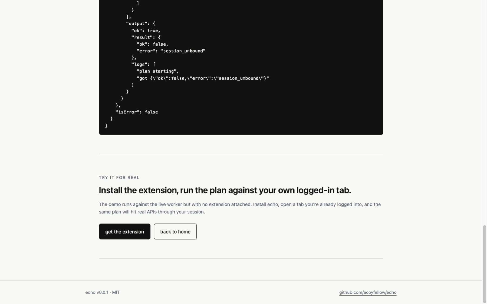

# echo

**Your tab is the agent's tab.**

echo turns a logged-in browser tab into a remote target for an MCP agent. The agent submits a TypeScript plan; Cloudflare runs it as a Workflow whose steps execute code in your tab; the receipt is the workflow's step log. No tokens. No headless Chrome. No credential vault.

```ts
const { planId } = await mcp.echo.run(`
  async ({ tab, log }) => {
    const r = await tab.execute({
      code: \`
        const resp = await fetch("/rest/api/2/search?jql=assignee=currentUser()", {
          credentials: "include"
        });
        return await resp.json();
      \`
    });
    log("got " + r.result.issues.length + " tickets");
    return r.result;
  }
`);
```

[](https://deploy.workers.cloudflare.com/?url=https://github.com/acoyfellow/echo) · [live demo](https://echo.coy.workers.dev/demo)

---

## What it is

- **One MCP tool: `echo.run(plan)`.** The agent submits a JS function expression. The Worker runs it inside a Worker Loader sandbox whose only outbound is a binding to your authenticated tab.
- **Durable.** Each step is a Cloudflare Workflow step. Plans can sleep for hours, survive tab close, replay on retry. Step history is the receipt chain.
- **Same trust model as Codex.** OpenAI's Codex desktop app already gives a remote agent your authenticated browser. echo does the same thing — but the browser stays on your machine, and the agent can be any MCP client.

## The composition

| Primitive | Role |
|---|---|
| Dynamic Workers (Worker Loader) | The plan runs in a per-call V8 isolate. `globalOutbound: null`. 13ms cold-start. No way to reach the supervisor's storage or signing key. |
| DO Facets | Each plan gets its own SQLite scratch DB inside the session DO. The supervisor cannot read it. |
| Dynamic Workflows | Plans are durable: sleep for hours, survive tab close, replay on retry. Step history *is* the receipt chain. |
| `cloudflare/agents` SDK | Glues the WebSocket transport, sub-agents-as-facets, and the workflow integration. |

## Try it locally

```bash
git clone https://github.com/acoyfellow/echo && cd echo
bun install
bun run dev
```

Open <http://127.0.0.1:8870>. The `/demo` page mints a real session against your local worker, submits a plan, polls status. No extension required — the plan returns `session_unbound`, which is the proof: your tab is the only thing that can fulfill calls.

## Deploy your own

[](https://deploy.workers.cloudflare.com/?url=https://github.com/acoyfellow/echo)

Or manually:

```bash
echo $(openssl rand -base64 48) | bun run setup:secret
bun run deploy
```

You get a Worker at `echo.<your-subdomain>.workers.dev` with:
- the docs site
- the MCP endpoint
- the WebSocket relay
- per-session Durable Objects
- per-plan Workflows

Your account, your audit, your rate limits.

## Install the extension

```bash
bun run build:ext
# Chrome → chrome://extensions → Developer mode → Load unpacked → echo/extension/dist
```

Then click the echo icon on any tab you're logged into. Copy the MCP URL. Add it to any MCP client.

## The trust posture

- Session is HMAC-signed to one tab origin.
- Closing the tab revokes the session.
- Plan code runs in your tab's same-origin realm — you sign in once, normally.
- Worker never sees your cookies; tab handles credentials via `credentials: "include"`.
- Every step is a durable receipt in the workflow's history.

Same model as Codex desktop. Different blast radius: your browser stays your browser.

## Repo layout

```
src/
  index.ts        worker entry
  agent.ts        EchoAgent — the supervisor (Agent DO)
  plan.ts         EchoPlan — Dynamic Workflow that runs plans
  tab-binding.ts  WorkerEntrypoint the plan facet calls back through
  mcp.ts          one tool: echo.run(plan)
  auth.ts         HMAC-signed session ids
  site.ts         the public docs site
extension/
  manifest.json   MV3
  background.ts   AgentClient WS, message routing
  content.ts      runs code in the page realm
```

## License

MIT.

---


